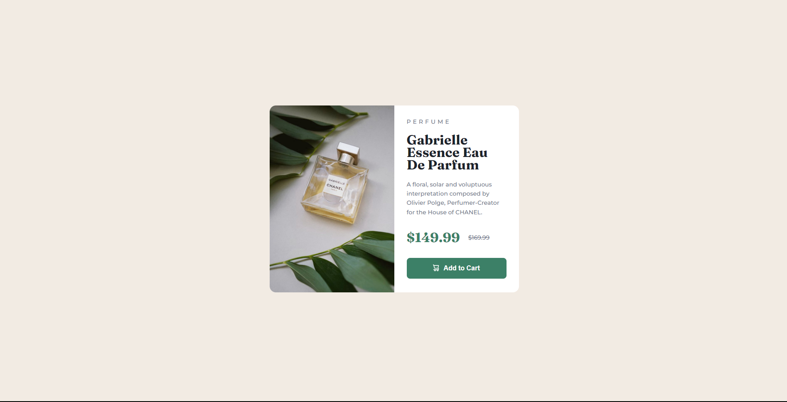

# Frontend Mentor - Product preview card component solution

This is a solution to the [Product preview card component challenge on Frontend Mentor](https://www.frontendmentor.io/challenges/product-preview-card-component-GO7UmttRfa). Frontend Mentor challenges help you improve your coding skills by building realistic projects. 

## Table of contents

- [Overview](#overview)
  - [The challenge](#the-challenge)
  - [Screenshot](#screenshot)
  - [Links](#links)
- [My process](#my-process)
  - [Built with](#built-with)
  - [What I learned](#what-i-learned)
  - [Continued development](#continued-development)
- [Author](#author)
- [Acknowledgments](#acknowledgments)

**Note: Delete this note and update the table of contents based on what sections you keep.**

## Overview

### The challenge

Users should be able to:

- View the optimal layout depending on their device's screen size
- See hover and focus states for interactive elements

### Screenshot



### Links

- Solution URL: [https://www.frontendmentor.io/solutions/results-summary-component-I4PiUqkaCH](https://www.frontendmentor.io/solutions/results-summary-component-I4PiUqkaCH)
- Live Site URL: [https://lucassilvaaraujo.github.io/product-preview-card-component-main/](https://lucassilvaaraujo.github.io/product-preview-card-component-main/)

## My process

### Built with

- Semantic HTML5 markup
- CSS custom properties
- Flexbox
- CSS Grid

### What I learned

Nothing new this time :V Just some better structure.

```html
<body>
  <main class="announce">
    <section class="perfume-announce">
      <div class="perfume-image"></div>
      <div class="perfume-info">
        <div class="perfume-text">
          <h1 class="announce-type">PERFUME</h1>
          <h2 class="item-name">Gabrielle Essence Eau De Parfum</h2>
          <p class="item-description">A floral, solar and voluptuous interpretation composed by Olivier Polge,
            Perfumer-Creator for the House of CHANEL.</p>
        </div>
        <div class="perfume-cost">
          <h1 class="item-price">$149.99</h1>
          <h2 class="item-original-price"><s>$169.99</s></h2>
        </div>

        <button class="add-to-cart">Add to Cart</button>
      </div>
    </section>
  </main>
```

### Continued development

Nothing in my planning... maybe try to do a better responsive structure?

## Author

- Website - [Lucas Araújo](https://lucassilvaaraujo.github.io/portfolio/)
- Frontend Mentor - [@LucasSilvaAraujo](https://www.frontendmentor.io/profile/LucasSilvaAraujo)
- Twitter - [@shalkzera](https://instagram.com/shalkzera)

## Acknowledgments

I wanna give some thanks to [@LaissonBruno](https://github.com/laissonbruno) that always help me :D
